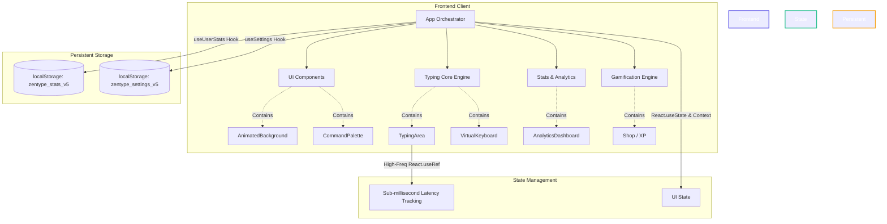
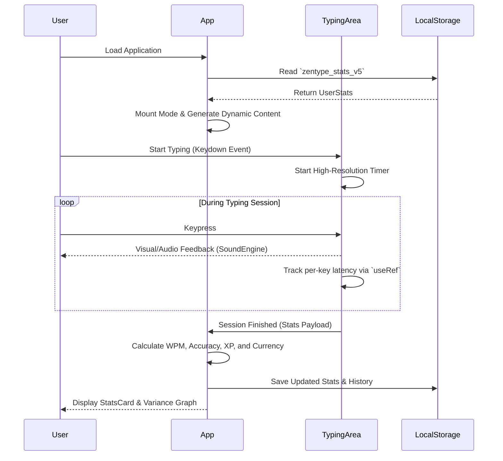

<div align="center">
  <h1>🚀 ZenType Pro</h1>
  <p><strong>A progressive, highly-customizable React typing tutor designed for speed, flow, and focus.</strong></p>

  [](https://opensource.org/licenses/MIT)
  [](https://reactjs.org/)
  [](https://vitejs.dev/)
  [](https://www.typescriptlang.org/)
  []()
  []()

</div>

---

## 📖 Project Overview

**ZenType Pro** is a modern, lightweight Single Page Application (SPA) built to help developers and typists improve their speed and accuracy.

**The Problem**: Standard typing tests are static, visually uninspiring, and fail to provide long-term retention metrics.  
**The Solution**: ZenType offers dynamic content generation, robust gamification, offline-first local storage, and deep customization to keep users engaged and in a state of "flow."

### Key Features
- **15+ Dynamic Modes**: Ranging from Classic & Word modes to Sudden Death, Blind, Mirror, and Terminal (Code) modes.
- **Advanced Gamification**: XP, Levels, Streak tracking, and an in-game currency ("TypeCoins") to purchase cosmetic upgrades.
- **Deep Customization**: 10 distinct color themes, 5 keyboard layouts, various sound packs (Thocky, Cherry, etc.), and dynamic caret animations.
- **Privacy First**: 100% of your data and statistics are saved locally to your browser. No accounts, no backend tracking.

---

## 🏗 Technical Documentation

### Technology Stack
- **Core Engine**: React 19, TypeScript
- **Build & Optimization**: Vite 6, Rollup
- **Styling & UI**: Tailwind CSS, Framer Motion, Lucide React
- **Testing**: Vitest, React Testing Library
- **Deployment**: Configured for static hosting (e.g. Netlify, GitHub Pages)

### System Architecture Diagram



### Application Flow Diagram



### Design Decisions
- **React Best Practices**: Keystroke latency and replay tracking arrays update on *every single keystroke*. Storing these in `useState` would cause massive DOM churn and frame drops. By migrating them to `useRef`, we completely bypass the React reconciliation cycle during intense typing, guaranteeing a stable 60+ FPS.
- **Domain-Driven Component Structure**: Components are cleanly separated into `/ui`, `/typing`, `/stats`, and `/gamification` folders, ensuring the project remains highly maintainable as it scales.

---

## 🌟 Project Quality

### Security Considerations
- **Data Privacy**: No PII is collected. Everything lives in the browser.
- **XSS Prevention**: React automatically escapes user input.
- **CSP & Headers**: Ensure your hosting provider is configured to enforce strict `Content-Security-Policy`, `Strict-Transport-Security`, and `X-Frame-Options` headers to prevent clickjacking and malicious script execution.
- **Dependencies**: Continuously audited. Current known vulnerabilities: **0**.

### Performance Optimizations
- Lazy-loaded heavy components (e.g., `AnalyticsDashboard` is wrapped in `React.lazy`).
- Asset optimization and caching via Vite.

---

## 🚀 Developer Experience & Setup

### Local Development Setup

1. **Clone the repository**
   ```bash
   git clone https://github.com/Sh1vaay/zentype-pro.git
   cd zentype-pro
   ```

2. **Install dependencies**
   ```bash
   npm install
   ```

3. **Start the development server**
   ```bash
   npm run dev
   ```
   The app will be available at `http://localhost:3000`.

### Testing
ZenType uses Vitest for rapid unit testing.
```bash
npm run test
```


## 🤝 Contributing Guidelines

We welcome open-source contributions!

1. Fork the repository.
2. Create your feature branch (`git checkout -b feature/AmazingFeature`).
3. Ensure your code passes linting (`npm run lint`) and formatting (`npm run format`).
4. Ensure all tests pass (`npm run test`).
5. Commit your changes (`git commit -m 'Add some AmazingFeature'`).
6. Push to the branch (`git push origin feature/AmazingFeature`).
7. Open a Pull Request.

---

<div align="center">
  <p>Built with ❤️ by the open-source community.</p>
</div>
