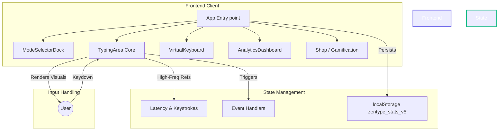
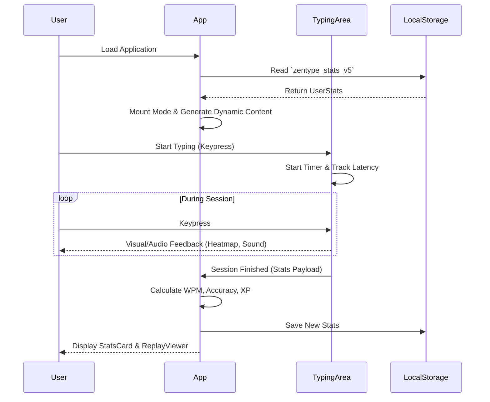

<div align="center">
  <h1>🚀 ZenType Pro</h1>
  <p><strong>A progressive, highly-customizable React typing tutor designed for speed, flow, and focus.</strong></p>

  [](https://opensource.org/licenses/MIT)
  [](https://reactjs.org/)
  [](https://vitejs.dev/)
  [](https://www.typescriptlang.org/)
  []()

</div>

---

## 📖 Project Overview

**ZenType Pro** is a modern, lightweight Single Page Application (SPA) built to help developers and typists improve their speed and accuracy. Unlike standard typing tests, ZenType offers dynamic content generation, robust gamification, and deep customization to keep users engaged and in a state of "flow."

### Key Features
- **15+ Dynamic Modes**: Ranging from Classic & Word modes to Sudden Death, Blind, Mirror, and Terminal (Code) modes.
- **Advanced Gamification**: XP, Levels, Streak tracking, and an in-game currency ("TypeCoins") to purchase cosmetic upgrades.
- **Deep Customization**: 10 distinct color themes, 5 keyboard layouts, various sound packs (Thocky, Cherry, etc.), and dynamic caret animations.
- **Performance Optimized**: Built using Vercel React Best Practices. Ensures 60+ FPS even with rapid keystrokes and complex latency rendering.
- **Local Privacy**: All stats and configurations are stored purely locally via `localStorage`—no backend tracking.

---

## 🏗 System Architecture

ZenType Pro is built as a pure client-side React SPA, relying on `localStorage` for state persistence and a highly optimized render loop for minimal input latency.



### Application Flow



---

## 🛠 Technology Stack

- **Core**: React 19, TypeScript
- **Build Tool**: Vite 6
- **Styling**: Tailwind CSS, Framer Motion
- **Testing**: Vitest, React Testing Library, JSDOM
- **Icons**: Lucide React

### Design Decisions
- **useRef for Transient State**: Keystroke latency and replay tracking arrays update on *every single keystroke*. Storing these in `useState` caused massive DOM churn. Migrating them to `useRef` following Vercel's guidelines removed re-render overhead completely.
- **Client-Side Only**: Deliberate choice to avoid a backend. This guarantees zero latency issues from network requests during typing, prioritizing the core typing experience.
- **Error Boundaries**: Hard-wrapping the main app tree ensures that if a theme or custom layout crashes, the app gracefully falls back to a reset screen rather than white-screening.

---

## 🚀 Developer Experience & Setup

### Local Development Setup

1. **Clone the repository**
   ```bash
   git clone https://github.com/Sh1vaay/zentype-pro.git
   cd zentype-pro
   ```

2. **Install dependencies**
   ```bash
   npm install
   ```

3. **Start the development server**
   ```bash
   npm run dev
   ```
   The app will be available at `http://localhost:3000`.

### Testing
ZenType uses Vitest for rapid unit testing.
```bash
npm run test
```

---

## 🛡 Security & Quality

- **Data Privacy**: No PII is collected. Everything lives in the browser.
- **XSS Prevention**: React automatically escapes user input and dynamic content generation blocks script injection.
- **Performance**: Heavy emphasis on minimizing React renders (`rerender-move-effect-to-event`, `rerender-lazy-state-init`).
- **Observability**: Error boundary traps and logs critical failures to the console, allowing safe soft-resets of local configurations.

---

## 🤝 Contributing Guidelines

1. Fork the repository.
2. Create your feature branch (`git checkout -b feature/AmazingFeature`).
3. Ensure your code passes linting (`npm run lint`) and formatting (`npm run format`).
4. Ensure all tests pass (`npm run test`).
5. Commit your changes (`git commit -m 'Add some AmazingFeature'`).
6. Push to the branch (`git push origin feature/AmazingFeature`).
7. Open a Pull Request.

---

<div align="center">
  <p>Built with ❤️ by the open-source community.</p>
</div>
